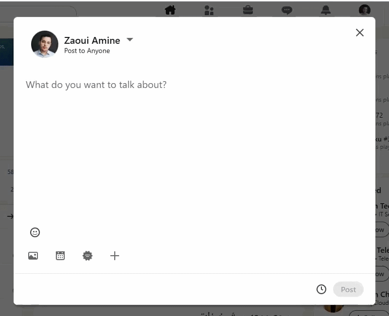

# LinkedIn Post Formatter

A browser extension that lets you format LinkedIn post/comment text — **bold**, *italic*, underline, strikethrough, monospace, bullet/numbered lists, hashtags, mentions, and quick arrow/checkmark symbols — using real Unicode characters, no rich-text markup involved.

## How it works

LinkedIn has no rich-text formatting API, so every "bold" or "italic" character you see in a LinkedIn post is actually a different Unicode character that merely *looks* styled (e.g. `growth` → `𝗴𝗿𝗼𝘄𝘁𝗵`, using the Mathematical Alphanumeric Symbols block). This extension builds that substitution for you and writes it directly into the post editor.

**Select some text** in the post box and a small floating toolbar appears right above it — click Bold, Italic, Underline, Strikethrough, or open **More ▾** for monospace/lists/hashtag/mention. **Just pause the cursor** (no selection needed) after a word or at the start of a line and a small `→` chip appears — hover or click it to expand into a symbol grid (`→ ← ↳ ⇒ ➤ ▶ ✅ ❌ ⭐ 💡 🔥 👉`) for inserting arrows and callout marks without breaking your typing flow.

### Why this isn't as simple as it sounds

LinkedIn's editor is [Quill](https://quilljs.com/), rendered inside an **open Shadow DOM**. Two things this project had to solve that a naive implementation gets wrong:

- `document.getSelection()` does **not** reflect what's actually selected inside that shadow root — you have to call `.getSelection()` on the shadow root itself (see `getDeepSelectionContext()` in `content.js`).
- Quill keeps its own internal "Delta" model; the DOM is just a rendering of it. Splicing the DOM directly (or via `document.execCommand`) can desync from that model and get silently discarded on the next re-render. The extension finds the live Quill instance (duck-typed by its real API shape, not a brittle property name) and drives it directly via `quill.deleteText()` / `quill.insertText()` with the `'api'` source flag, which updates model and DOM together.

## Install

1. Open `chrome://extensions/` (or `brave://extensions/`)
2. Toggle **Developer mode** on (top-right)
3. Click **Load unpacked**
4. Select this folder

Works automatically on `linkedin.com` — no popup, no configuration.

**After changing the code:** go back to `chrome://extensions/` and click the reload icon on the extension card, then refresh the LinkedIn tab.

## Files

| File | Purpose |
|---|---|
| `manifest.json` | Manifest V3 extension config |
| `content.js` | The extension itself — formatting logic + floating toolbar + Shadow DOM/Quill detection |
| `linkedin-formatter-tool.html` | A standalone web version (no extension needed) — write in a plain editor, see a live feed-post preview, copy the formatted result into LinkedIn manually |
| `demo-script.js` | Paste into DevTools console on an open LinkedIn post composer to run an unattended demo of every feature (useful for screen recordings) |
| `icons/` | Toolbar icon |

## Formatting reference

| Button | Effect |
|---|---|
| B / I / U / S | Bold / Italic / Underline / Strikethrough (Unicode) |
| `</>` | Monospace |
| • / 1. | Bullet / numbered list |
| # | Prefix each word with `#` |
| @ | Prefix with `@` |
| → chip | Insert a symbol at the cursor (arrows, checkmarks, callouts) |

Clicking an already-applied style toggles it back off.
